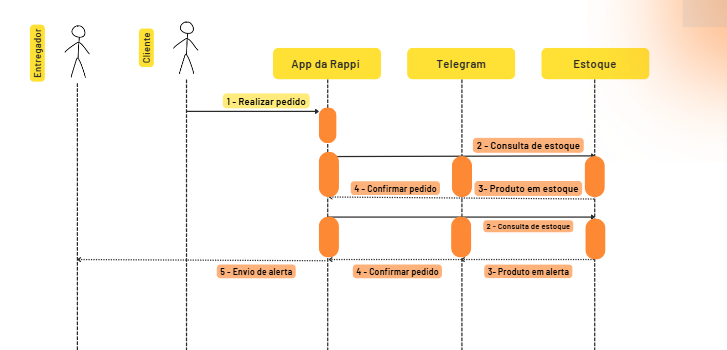

# Estrutura de Integração

A integração segue uma arquitetura baseada em eventos, onde o estoque é monitorado continuamente e alertas são enviados para WebSocket e Telegram quando ocorrem mudanças críticas.  

### Estrutura Geral da Integração
- **Camadas:**
  1. **Camada de Entrada**  
     - API REST (FastAPI) → Endpoint `/estoque` para consulta do estoque  
     - WebSocket (`/ws/estoque`) → Comunicação em tempo real
  2. **Camada de Processamento**  
     - Monitoramento contínuo do estoque (Tarefa assíncrona `monitorar_estoque()`)  
     - Gatilhos para enviar notificações quando estoque <5 unidades  
  3. **Camada de Notificação**  
     - WebSocket → Notifica clientes conectados  
     - Telegram Bot API → Envia alertas para entregadores  
  4. **Camada de Persistência** (opcional)  
     - Neste caso, usamos um **dicionário em memória**, mas poderia ser um banco de dados como PostgreSQL ou Redis.  


### Módulos e Componentes
| **Módulo**  | **Descrição**  |
|-------------|---------------|
| `FastAPI`   | Framework para expor a API REST e WebSocket |
| `WebSocket` | Canal de comunicação em tempo real para clientes conectados |
| `asyncio`   | Gerenciamento assíncrono para monitorar estoque continuamente |
| `requests`  | Cliente HTTP para comunicação com a API do Telegram |
| `Telegram Bot API` | Serviço externo que recebe e processa notificações de alerta |


# Documentação e Controle de Qualidade da Integração

### Fluxo de integração




1- Usuário adiciona um item ao pedido no Rappi
2️- estoque é atualizado automaticamente 
3️- Se o estoque ficar abaixo de 5 unidades, a API:
   - Notifica o WebSocket
   - Dispara um alerta no Telegram
4 - O entregador recebe a notificação e pode agir rapidamente


### Controle de Qualidade da Integração
Os seguintes pontos garantem a qualidade da integração:

**Monitoramento de Tempos e Desempenho**
   - Tempo médio de atualização do estoque: **< 1s**  
   - Tempo médio de entrega da notificação no Telegram: **< 2s**  
   - Tempo de resposta da API WebSocket: **< 50ms**  

**Protocolos Utilizados**
   - API REST (HTTP + JSON)
   - WebSocket (Protocolo WS para comunicação em tempo real)
   - Telegram Bot API (HTTPS)

**Controle de Versões**
   - GitHub para versionamento do código
   - Uso de tags para marcar versões (`v1.0`, `v1.1`, etc.)

**Tratamento de Exceções**
   - Caso a API do Telegram falhe → **Repetir a requisição até 3 vezes** antes de registrar um erro.
   - Se um WebSocket desconectar → **Remover conexão da lista ativa** sem afetar os demais usuários.
   - Se o monitoramento falhar → **Logar erro e reiniciar a tarefa automaticamente**.


### Exemplo de Tratamento de Exceções no Código
```python
def enviar_mensagem_telegram(mensagem: str):
    url = f"https://api.telegram.org/bot{TELEGRAM_BOT_TOKEN}/sendMessage"
    payload = {"chat_id": TELEGRAM_CHAT_ID, "text": mensagem}

    for tentativa in range(3):  # Tentar 3 vezes em caso de falha
        try:
            response = requests.post(url, json=payload, timeout=5)
            if response.status_code == 200:
                logging.info(f"Mensagem enviada ao Telegram: {mensagem}")
                return
            else:
                logging.warning(f"Tentativa {tentativa + 1} falhou: {response.text}")
        except requests.exceptions.RequestException as e:
            logging.error(f"Erro ao conectar com Telegram: {e}")

    logging.error("Falha ao enviar mensagem após 3 tentativas.")
```
